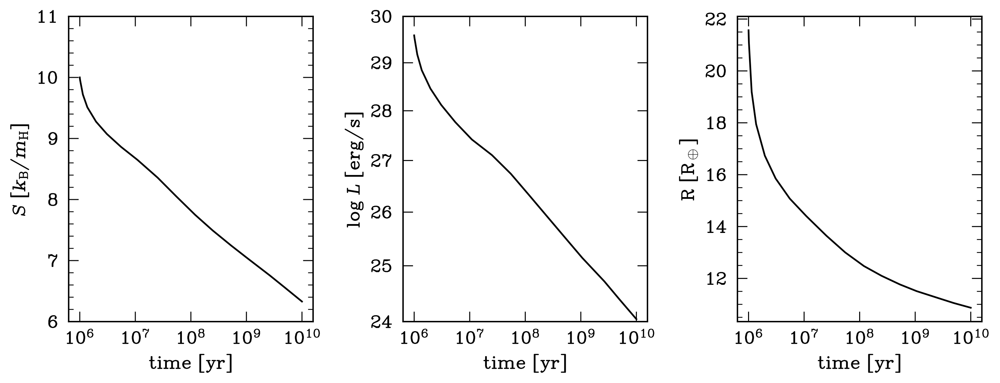

# PSAND: Planetary Structure ANd Dynamics
A python method to couple planetary structure and dynamics, as published in [Hallatt & Millholland (2025)](https://ui.adsabs.harvard.edu/abs/2025arXiv250922923H/abstract).

If you use PSAND, please cite [Hallatt & Millholland (2025)](https://ui.adsabs.harvard.edu/abs/2025arXiv250922923H/abstract).

Please also reach out to me if you would like to collaborate, have questions, or if you would like custom structure models to be created. I can be reached at thallatt@mit.edu.

Data files for interpolation take up 117 MB (compressed) / 538 MB (uncompressed).

The structure grids cover temperatures 288-2884 K, core masses {10, 20} Earth masses, total masses [10.1,300] Earth masses, and "metallicities" (assumed SiO2) {0.02,0.1,0.5}.

## A minimal working example

This example loads our interpolation functions assuming solar composition gas, and a 10 Earth mass core. We set the irradiation temperature to 900 K and the total planet mass to 250 Earth masses. We integrate equation 5 from Hallatt & Millholland (2025). We then plot the entropy as a function of time.

```python
import numpy as np
from scipy.integrate import solve_ivp
import matplotlib.pyplot as plt

# import supermongo python plotting library (https://github.com/AstroJacobLi/smplotlib)
import smplotlib

# define our constants (cgs units)
yr=31560000.0
kB=1.3807e-16
mH=1.6726e-24

# planet properties (fixed in time for this example)
Tirr=900.
M=250.

# load our interpolation functions for planet structure
# core mass identifier string
mc='10'
# metallicity identifier string (solar)
z='0'
fTdm=np.load('data/fTm_mc'+mc+'_z'+z+'_1au.npy',allow_pickle=True).item()
fL=np.load('data/fL_mc'+mc+'_z'+z+'_1au.npy',allow_pickle=True).item()
fR=np.load('data/fR_mc'+mc+'_z'+z+'_1au.npy',allow_pickle=True).item()

# this function defines our extra heating rate. for this example, we set it to zero.
def Lx(t):
  return 0.

# this function evolves planet entropy by "stepping through the adiabats" (equation 5 of Hallatt & Millholland (2025)).
def dSdtm(S,Lextra_,M,Tirr):
  return (-fL(S,M,Tirr)+Lextra_)/fTdm(S,M,Tirr)

# this function yields the differential equation to be solved with scipy
def fevo(t,y):
  S=y[0]
  Lextra=Lx(t)
  dsdt=dSdtm(S,Lextra,M,Tirr)
  return [dsdt]

# define initial conditions
t0,tend=1e6*yr,1e10*yr
S0=10.

# integrate thermal evolution!
sol=solve_ivp(fevo,[t0,tend],[S0*kB/mH])

# output from our integration
Sout=sol.y[0]
Rout=fR(Sout,M,Tirr)
Lout=fL(Sout,M,Tirr)

# plot our output!
fig, (ax1,ax2,ax3) = plt.subplots(1,3,figsize=(10, 4))
ax1.semilogx(sol.t/yr,Sout/(kB/mH))
ax1.set_xlim(t0/yr,tend/yr)
ax1.set_ylim(6,11)
ax1.set_title('S vs. time')
ax1.set_ylabel(r'S [$k_{B}/m_{H}$]')
ax1.set_xlabel('time [yr]')
ax1.set_xticks([1e6,1e7,1e8,1e9,1e10])
ax1.set_yticks([6.,7.,8.,9.,10.,11.])

ax2.loglog(sol.t/yr,Lout)
ax2.set_xlim(t0/yr,tend/yr)
ax2.set_ylim(1e24,,1e30)
ax2.set_title('L vs. time')
ax2.set_ylabel(r'L [erg/s]')
ax2.set_xlabel('time [yr]')
ax2.set_xticks([1e6,1e7,1e8,1e9,1e10])
ax2.set_yticks([1e24,1e25,1e26,1e27,1e28,1e29,1e30])

ax3.semilogx(sol.t/yr,Rout)
ax3.set_xlim(t0/yr,tend/yr)
ax3.set_ylim(10.,25.)
ax3.set_title('R vs. time')
ax3.set_ylabel(r'R [R$_{\oplus}$]')
ax3.set_xlabel('time [yr]')
ax3.set_xticks([1e6,1e7,1e8,1e9,1e10])
ax3.set_yticks(np.arange(10.,25.))

fig.tight_layout()
fig.savefig('example_evolution.png',bbox_inches='tight')
```

